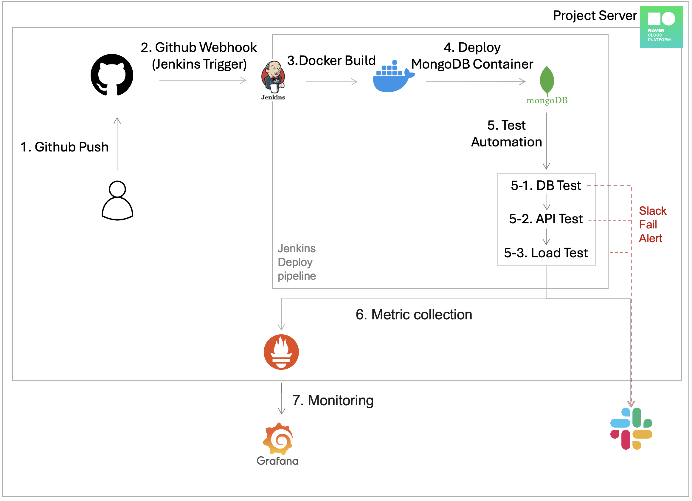

### 개요
MongoDB 기반의 웹 서비스를 클라우드 환경에서 운영하며, 코드 변경 시 자동 빌드, 테스트, 성능 측정  결과를 Slack으로 알림하는 CI/CD 파이프라인입니다.  
개발자는 GitHub에 코드를 푸시하여 자동 테스트 및 품질 확인이 가능합니다.  

### 주요 구성
* GitHub: 코드 저장소 및 푸시 이벤트 발생
* Jenkins: CI/CD 파이프라인 자동 실행
* Artillery: Node.js 기반 부하 테스트 도구
* Slack: 테스트 결과 및 빌드 상태 알림
* Naver Cloud Platform : MongoDB 서비스 운영 인프라

### 전체 흐름

  

